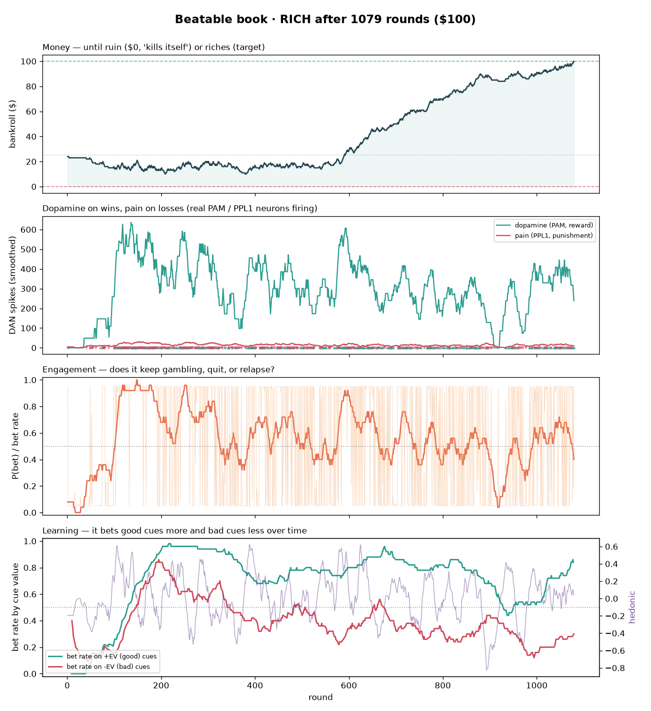
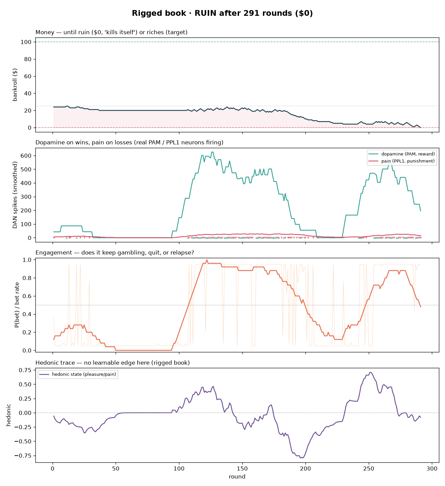
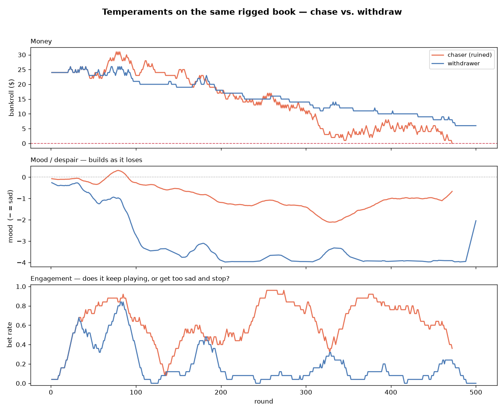
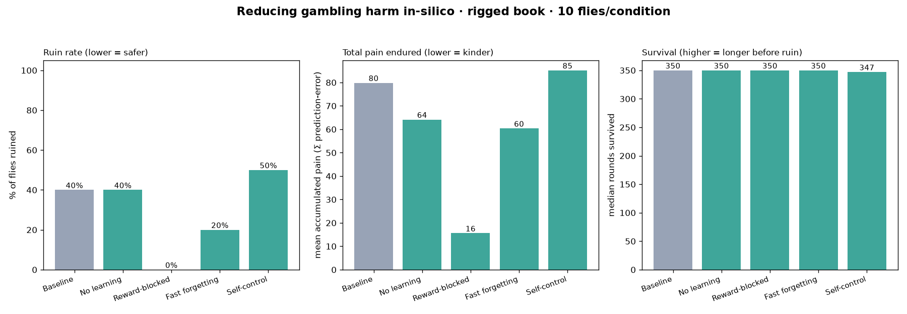

# 🪰🎲 FlyGambler

**A real fruit-fly connectome's mushroom body, wired to a betting terminal.** It
sees a cue, decides whether to bet, gets a squirt of **dopamine when it wins** and
a jolt of **pain when it loses**, learns which bets pay, and plays until it goes
**broke ($0)** or **rich ($100)** — then a new fly is born and it starts over.
Forever.

**▶ Watch it live:** <https://claude.ai/artifact/XRTRTir5G1KG21AHsWngmt>

> **Why a fly?** The fly **mushroom body** is one of the best-understood learning
> circuits in biology, and it is *literally* a dopamine-based reinforcement-learning
> machine: Kenyon cells sparsely encode the situation, their synapses onto output
> neurons (MBONs) store learned value, and dopamine neurons (**PAM** = reward,
> **PPL1** = punishment) rewrite those synapses. So "a brain that gambles, feels
> dopamine and pain, and learns" maps onto real, published neuroscience.

---

## See it

**It learns a *beatable* game and gets rich.** The cue predicts the outcome; the
fly's KC→MBON weights discover which cues pay, so it bets the good ones (green),
passes the bad ones (red), and climbs from \$25 to \$100.



**It chases an *unbeatable* game to ruin.** No edge to find — it briefly quits,
but an intermittent win streak (the same variable-ratio hook that drives human
gambling) pulls it back into compulsive betting, and the house edge grinds it to \$0.



**Does it get too sad to keep playing?** Sustained losses build a slow **mood**.
A *chaser* stays sad but keeps betting and goes broke; a *withdrawer* gets too sad,
disengages, and stops — the sadness is *protective*.



**What reduces the harm?** Across random-fly populations on the rigged game, the
innate pain fires in every condition, but the *path to ruin is learned*: **blocking
win-driven reinforcement takes ruin ~40% → 0% and cuts pain ~80%**, while simply
adding "self-control" doesn't help. The harm is a learned reinforcement loop —
breaking that loop beats willpower.



---

## Quickstart

```bash
python3 -m venv .venv && source .venv/bin/activate
pip install -e .                    # installs the package + deps
python scripts/download_data.py     # fetches the connectome (~135 MB, one time, no login)
```

Then:

```bash
# prove the real whole brain (all ~140k neurons) boots and spikes
python scripts/01_validate_wholebrain.py

# one fly's gambling life -> runs/life_*.png + .json
python scripts/02_run_fly.py --book learnable
python scripts/02_run_fly.py --book fair          # truly random 50/50

# a population of random flies -> the distribution of fates
python scripts/03_run_population.py --book fair --n 60

# innate vs learned + "how do you stop the pain?" -> runs/interventions.png
python scripts/04_interventions.py --n 60

# chase-to-ruin vs. get-too-sad-and-stop -> runs/temperaments.png
python scripts/05_temperaments.py --n 20

# watch the REAL brain gamble FOREVER, live in your terminal
# (respawns on every $0 / $100; archives each life to runs/lives.jsonl)
python scripts/06_watch_forever.py --temperament withdrawer
```

Runs are **randomized each time** — pass `--seed N` for reproducibility.

---

## What's real, what's ours, what's metaphor

**Real:** the **connectome** (139,255 neurons, ~15M synapses; FlyWire); the
**circuit**, pulled by cell type with its real synapses — **2,597 Kenyon cells**,
**48 MBONs**, the **153-neuron PAM** reward cluster, **8-neuron PPL1** punishment
cluster, **APL**, and **344** projection neurons (KC→MBON: ~24k connections this
hemisphere); the **spiking model** (leaky integrate-and-fire; Shiu et al., *Nature*
2024); and **dopamine/pain as real events** (wins fire PAM, losses fire PPL1).

**Ours (clearly flagged):** the published model has **fixed weights and does not
learn** — so we add **dopamine-gated plasticity** at the KC→MBON synapses (faithful
to Aso/Hige/Cohn/Owald biology), the betting task, and a slow **mood** state.

**Metaphor:** the fly doesn't *feel* or *choose to die*; reward/punishment signals
that reshape behavior are the *mechanistic basis* of what we call those things.
No real money — "ruin" is bankroll → \$0 (gambler's ruin). **A model, not medical
advice** — real gambling harm is clinical, with real help available.

## Two engines (so it's both real and fast)

Brian2 has a large fixed per-`run()` cost, and a gambling life is thousands of
rounds — so the interactive loop runs on a **fast NumPy integrator of the identical
LIF equations and the same connectome weights** (validated against Brian2:
~5–10% Kenyon-cell sparseness, as in real flies). Brian2 is used to **validate**
the full 140k-neuron model (`scripts/01`). Both engines consume one shared
`Circuit` — see `flygambler/connectome.py`. The **live web app** runs a fast
*behavioral* model of the same circuit so it can play forever in a browser.

## One round (what "thinking and acting" means)

1. **Encode** the cue → drive real projection neurons → real ALPN→KC wiring makes a sparse Kenyon-cell code.
2. **Think** — the LIF network spikes ~100 ms; MBONs integrate KC input through the *current learned* weights.
3. **Act** — approach vs. avoidance MBON balance → bet or pass.
4. **Feel** — win → PAM dopamine; loss → PPL1 pain (size = reward-prediction error); mood tracks the running fortune.
5. **Learn** — dopamine-gated update rewrites the active Kenyon cells' KC→MBON weights.
6. **Live or die** — bankroll updates; at \$0 (ruin) or the target (rich) a new fly is born.

## Data & credits

- **Whole-brain LIF model:** Shiu, Sang, et al., *Nature* (2024). Code:
  <https://github.com/philshiu/Drosophila_brain_model> (vendored under `vendor/`, MIT).
- **FlyWire connectome:** Dorkenwald et al., *Nature* (2024).
- **Cell-type annotations:** Schlegel et al., *Nature* (2024) —
  <https://github.com/flyconnectome/flywire_annotations>.
- **Mushroom-body learning biology:** Aso et al. (2014); Hige et al. (2015); Cohn et al. (2015); Owald & Waddell.

The dopamine-gated learning, the mood state, and the betting task are this
project's own work, built on the above.

## Layout

```
flygambler/   connectome.py · fastlif.py · brain.py · game.py · simulate.py · plots.py · live_view.py · data_fetch.py
scripts/      00 download_data · 01 whole-brain · 02 one fly · 03 population · 04 interventions · 05 temperaments · 06 watch-forever
dashboard/    fly_gambler.html   (the live app)
assets/       figures used in this README
vendor/       the published Brian2 model (reused for validation)
```
